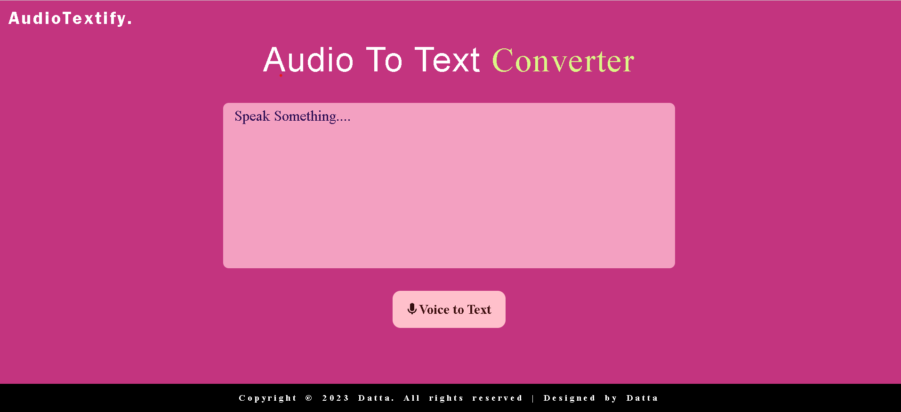

# AudioTextify

## Overview:
This project offers a real-time voice-to-text conversion, capturing live voice input and providing instant text output. It's built for efficiency and a seamless user experience.

## Features:

Live Voice Input
Instant Text Conversion
User-Friendly Interface
Technology Stack:

## Usage:

Clone the repository
Start the application
Speak into the microphone for real-time text conversion.

## Contributing:
Feel free to contribute by forking the project and opening a pull request.
